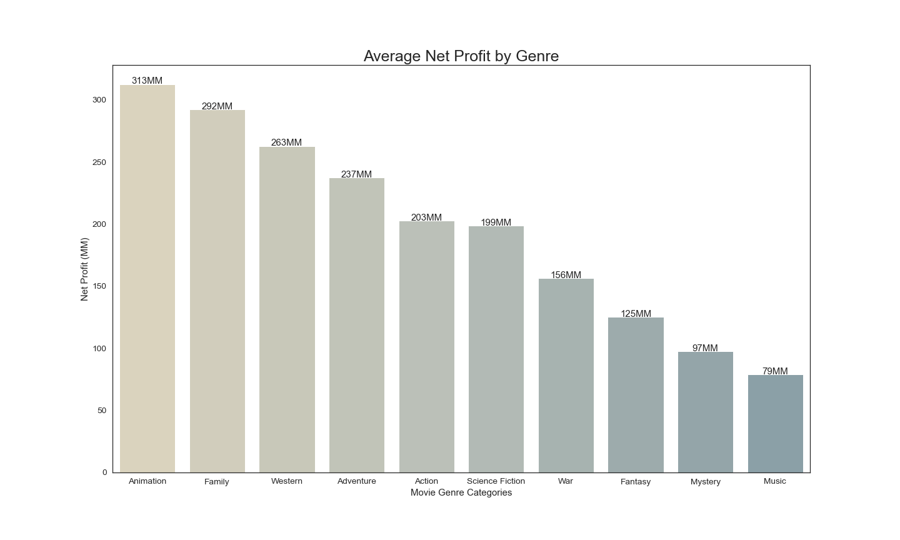
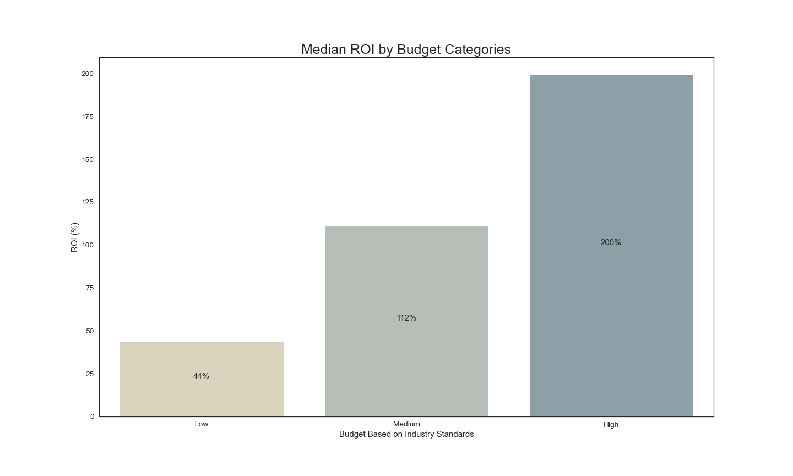
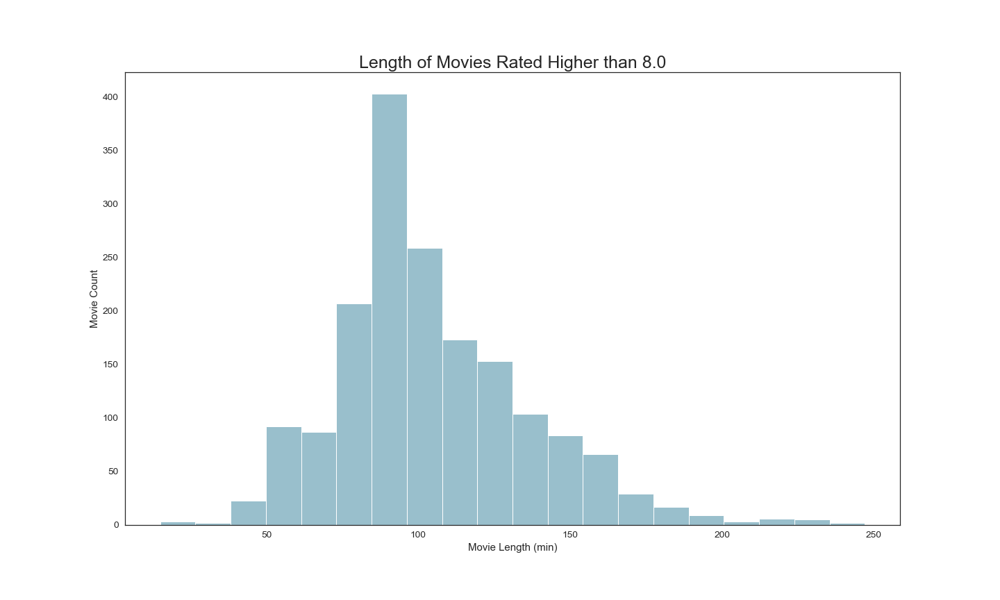

# Microsoft Movie Analysis

**Authors**: [Jonathan Fetterolf](mailto:jonathan.fetterolf@gmail.com), [Matthew Duncan](mailto:mduncan0923@gmail.com), [Nate Kist](mailto:natekist@outlook.com), & [Roshni Janakiraman](mailto:roshnij618@gmail.com)

## Instructions

NOTE: In order to run this notebook, you will need to download the necessary data file. A zipped version of the file can be downloaded: [here](https://github.com/fetterollie/Microsoft-Movie-Analysis/raw/main/zippedData/im.db.zip).

Please refer to the *"Importing IMDB Data"* section of our [Jupyter Notebook](./Movie_industry_analysis_notebook.ipynb) for more detailed instructions on unzipping and using the data.

## Overview

We analyzed multiple film databases to determine what factors make a movie successful. Descriptive analyses of movie characteristics and box office data show that Animation is the most profitable movie genre, high budget films provide the strongest return on investment (ROI), and the highest-rated films tend to be 85 - 100 minutes long.


## Business Problem

Microsoft may be able to improve their likelihood of producing box office successes by investing in films with similar characteristics to recent successful releases. The following questions guided our analyses:
 1. What genre of movie is most profitable?
 2. What type of budget should be allocated for this movie?
 3. What is the movie's expected runtime?

## Data

Data for this analysis is from three online movie databases.

### 1. The MovieDB (TMDB)

[TMDB](https://www.themoviedb.org/?language=en-US) is a user-built database of movie information and user ratings. The current dataset includes 26,517 datapoints and 9 columns of data. The target data includes release date and genre, where the genre codes are ordered by relevance.

### 2. The Numbers (TN)

[TN](url) dataset consists of box office information across 5,782 movies. The target data includes release date, production budget and worldwide gross revenue.

### 3. Internet Movie Database (IMDB)

[IMDb](url) is an online database consisting of movie information, statistics, and user ratings. The IMDB dataset is comprised of multiple tables. For the current analysis, we used two tables consisting of basic movie data and user ratings for movies. The target data includes release date, runtime length (in minutes), and average rating.

## Methods

This project uses descriptive analytics to describe trends in the features of successful movies. 

For all tables, we removed unnecessary columns, cleaned, and filtered all of the tables used. To make sure that the data we used was relevant to Microsoft's business question, we limited the data to only include movies released between 2010 - 2019 and English movies. All numerical columns were scaled to be in millions (MM). 

**Question 1**: We merged TN with TMDB to address Question #1. TMDB uses 18 primary genres to classify the movies in their database. We used a bar chart to examine the average net profit of each genre of movie, and limited our findings to the top 10 most profitable genres.

**Question 2**: Using the TN dataset, we calculated two new variables of interest: Net Profit and Return on Investment (ROI). The main analysis used a bar chart to compare the median ROI of films based on production budget. Based on definitions used by [Hollywood market researchers](https://papers.ssrn.com/sol3/papers.cfm?abstract_id=3751648), we grouped our data into 3 budget categories:
1. Low (less than $20 MM)
2. Medium ($20 MM - $100 MM)
3. High (greater than $100 MM)

We then compared the median ROI of each budget groups to determine which budget group provided the best value for its cost. We used the median ROI because there are extreme outliers in each budget group that might misrepresent how a 'typical' movie would fare.

**Question 3**: To address Question #3, we used the IMDB dataset. We decided to focus on the 'typical' runtime of highly rated films. We narrowed down the dataset to include only the highest rated movies (average user rating of 8.0 or greater) on IMDB. 

## Results

### Question 1: What genre of movie is most profitable? ###
* Over the 2010s, the **Animation** genre had the highest average yearly profit. ($313 MM per year)
* **Family** films, a related genre, was the second-highest profitable genre of the 2010s ($292 MM per year).



### Question 2: 
* High budget films provide the strongest ROI, with the typical high-budget film yielding a 200% ROI



### Question 3: 
* Out of all of the highest rated movies (ratings > 8.0), there were more movies in the 85 - 100 minute range than any other movie length.  
* This would indicate a viewer preference for movies with this length.



## Conclusions

This analysis leads to three recommendations for Microsoft's entry in the film industry:

1. **Produce movies within the 'animated' or 'family' genres to maximize net profit** 
    - Movies with the primary genres of 'animated' and ‘family’ have the highest average yearly net profits over the 2010s.
2. **Invest in high-budget films** 
    - High-budget films have the greatest potential for maximum returns
    - Microsoft should plan to invest at least **$200 MM** per film
3. **Make movies with a runtime length near 90 minutes**
    - Out of all highly rated movies, there were more movies in the 90-100 minute range than any other movie length. This indicates a viewer preference for movies with this length.

### Future Considerations

Further analyses could yield additional insights to improve recommendations for Microsoft's studio debut:

##### Recency of Data: Considering the Effect of COVID-19: #####
- Our data ends in the year 2019. By including updated data, we could provide a more accurate representation of the film industry, especially given that cinema attendance experienced [a drastic fall](https://www.whartonume.com/blog/covids-impact-on-the-film-industry-the-biggest-shift-in-the-history-of-hollywood), but is now [trending towards recovery](https://www.placer.ai/blog/movie-theaters-summer-2022-update-recovery-and-consumer-trends/).

- Additionally, it could be useful to examine what types of movies did well *in spite* of the pandemic: even with the barriers of COVID, what factors were compelling enough to draw people to theaters?

##### Additional Variables to Consider in Current Analyses #####
- Question 1: The number of movies in each genre is not taken into consideration. If there are a limited number of movies for a particular genre, the sample could be skewed high or low.

- Question 2: While we can show that high-budget films generally earn more profit, we do not know if people actually enjoyed the movies that were produced with a high budget.

- Question 3: The runtime length for movies below an average rating of 8.0 are not taken into consideration. We cannot draw specific conclusions that a 90 minute movie will help contribute to a higher rating, rather we can conclude that most higher rated films are within this runtime.
 

## For More Information

See the full analysis in the [Jupyter Notebook](./Movie_industry_analysis_notebook.ipynb) or review this [presentation](./presentation.pdf).

**For additional info, contact:**
- Jonathan Fetterolf: jonathan.fetterolf@gmail.com
- Matthew Duncan: mduncan0923@gmail.com
- Nate Kist: natekist@outlook.com
- Roshni Janakiraman: roshnij618@gmail.com


## Repository Structure

```
├── Scratch_Notebooks
│   ├── matt-prelim.ipynb
│   ├── nate-prelim.ipynb
│   ├── joining-df.ipynb
│   ├── jon-prelim.ipynb
│   └── roshni-prelim.ipynb
├── images
│   ├── director_shot.jpeg
│   ├── figure1.png
│   ├── figure2.png
│   ├── figure3.png
│   └── jheader.png
├── zippedData
│   ├── bom.movie_gross.csv.gz
│   ├── im.db.zip
│   ├── rt.movie_info.tsv.gz
│   ├── rt.reviews.tsv.gz
│   ├── tmdb.movies.csv.gz
│   └── tn.movie_budgets.csv.gz
├── Movie_industry_analysis_notebook.ipynb
├── presentation.pdf
└── README.md
```
